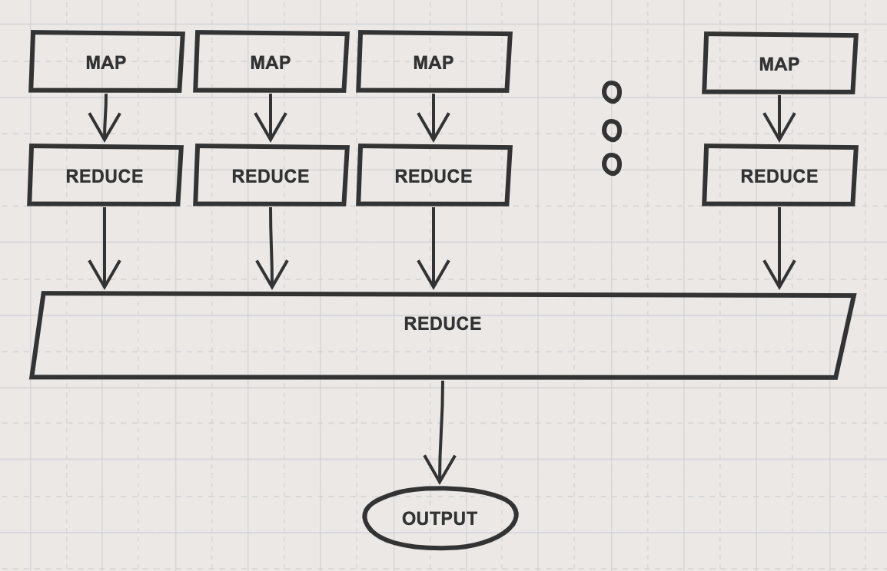
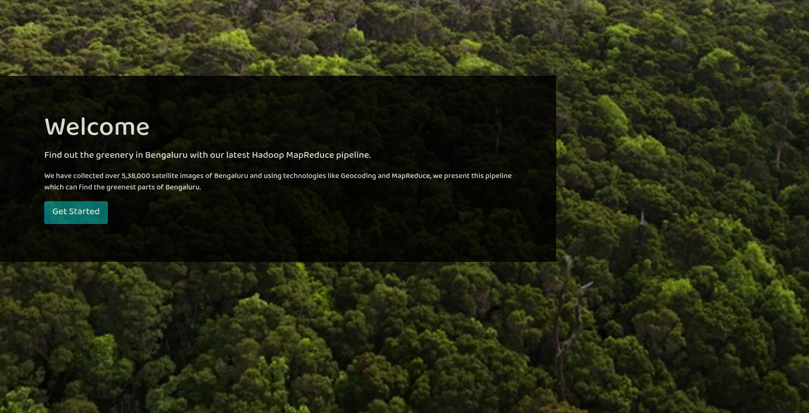
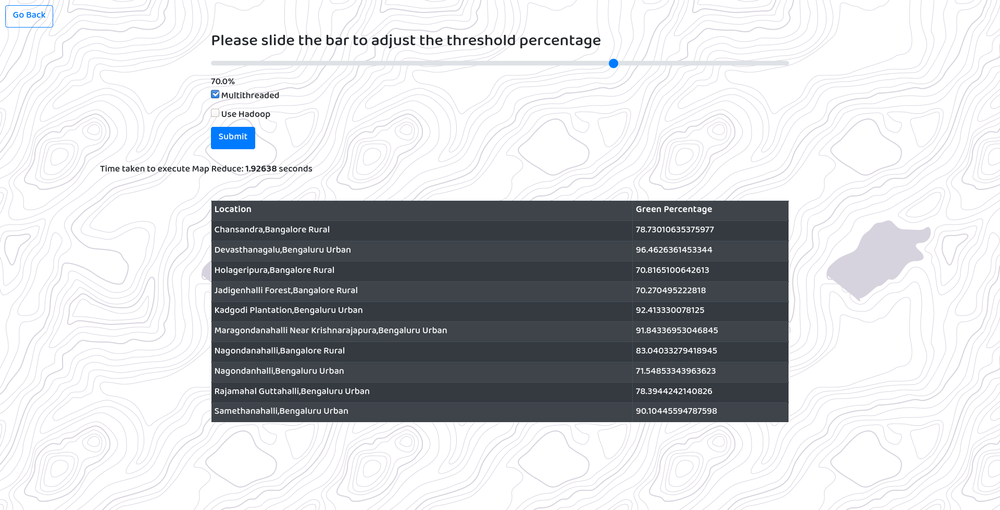

# Bengaluru's Greenest Parts

The objective was to find the greenest part of Bengaluru using satellite images

Website: https://ccbd-bangalore.herokuapp.com/

## The Team

 - [Aayush](https://github.com/NaikAayush/)
 - [Samyak S Sarnayak](https://github.com/Samyak2/)
 - [Varun P](https://github.com/varunp2k/)
 - [Pranav Kesavarapu](https://github.com/psiayn/)

## Overview

We collected 5,38,000 images from Google Earth Engine API and processed them using OpenCV to find the percentage of green in them.
To get the location details for the coordinates of the image, a Geocoding API was used.
The two datasets (image name with percentage of green and image name with coordinates and location) were joined using Pandas in python.
The resulting data was used for a MapReduce task. The output of the MapReduce task is a list of locations along with their percentage of green (only those areas with more green than a given threshold are included).
We also made a web app to demo this in real-time and hosted it on Heroku, a cloud platform. The application was containerized using Docker while deploying.

Since there was a huge amount of data, we made using of multi-threading. The OpenCV script uses multi-threading (using the multi-processing python library) to process a number of images in parallel and combines the output at the end. The final time was reduced to nearly 2 hours for processing all 5,38,000 images. We also use multi-threading to perform a number of API calls in parallel to reduce the time taken.

A custom Map Reduce program was implemented in python to be used in the web app. This implementation also supports multi-threading to break down the input into smaller chunks and apply map-reduce individually and then apply the reduce step again to get the final output.
This map reduce program takes around 10 seconds for the single-threaded version and around 4 seconds for the multi-threaded version (4 threads) to process a file with almost a million lines.

A 2-node Hadoop cluster was set up using Docker for performing Map Reduce tasks on a large scale.

## Details

This was done in the following steps:
 1. Data Collection: Downloading satellite images
 2. Image Processing: finding the green parts in a satellite images
 3. Geocoding: Getting address for the coordinates
 4. Data cleaning and processing: Joining tables, removing missing values, etc
 5. Map Reduce: To average the green percentage for an area and filtering those with above a threshold.
 6. Web app: To showcase the results in real-time, we made a web app and hosted.

### 1. Data Collection

 - Used the Google Earth Engine API
 - Initially we tested a few zoom levels and collected around 20,000 images. The results were not very good.
 - With the maximum zoom level, collected 5,38,000 images. 

### 2. Image Processing

- Used only OpenCV color filters
- Went through many iterations of HSV/RGB values to find the best mask range
- Calculated the number of green masked pixels
- Divided this by total number of pixels to find the percentage

### 3. Geocoding

- Taking the latitude and Longitude values from the generated images we make an API call.
- Tested out multiple API's
- Finalized with MApBox API because it is free and gives us considerable amount of data
- There are other free API's but they are with constraints such as max 10000 requests per day.

### 4. Data Cleaning and Processing

After merging all the smaller datasets, we ended with two CSV files with nearly 5,38,000 rows - one with the file name and percentage of green and another with file name and locations (co-ordinates, sub-district and district). Since the data was collected from a rectangular area, there were some images from outside Bengaluru, removing those we got a final dataset with 440,461 rows.

We then merged the two CSV files using pandas in python.

### 5. Map Reduce

We implemented a custom MapReduce program in python. The mapper takes the required columns from the data and formats it correctly (in a key-value pair) for Hadoop or the custom program to sort it. The data is sorted based on the key (which is the first part of the mapper's output) before being passed to the reducer.
The reducer groups the green percentages by the key (location) and averages it.

Since there was a large amount of data and python, by default, is single-threaded we implemented a multi-threaded version of the MapReduce program using the multiprocessing library in python. The input data is first broken into smaller chunks, map and reduce steps are applied to the chunks individually (in parallel). The output chunks are then concatenated and reducer is applied to the concatenated output to get the final output.

The same mapper and reducer in python were used in the Hadoop Streaming API to perform MapReduce using Hadoop. The Hadoop version is slower since we have only one node in the container and there some overhead in starting and stopping the streaming job.

### 6. Web App

The web app is a dockerized flask app built with HTML,CSS,Bootstrap and jQuery. It provides a responsive UI that works both on mobile and desktop browsers. The web app allows the user to control the threshold value of the MapReduce and even provides the user with options such as multithreading without Hadoop or running MapReduce with Hadoop. 

## Results

### Time taken for steps

 - Downloading Satellite Images: around 16 hours
 - Image Processing on all 5,38,000 images: around 2 hours (multi-threaded with 8 threads)
 - Geocoding: around 16 hours
 - Map Reduce:
    - On Heroku (with 1 virtual CPU):
        - Single-threaded custom: 5 seconds
        - Multi-threaded custom: 2.5 seconds
        - Hadoop (including overhead of starting and stopping): 8.5 seconds
    - On a laptop with 4 cores 8 threads CPU:
        - Single-threaded custom: 3.77 seconds
        - Multi-threaded custom: 1.78 seconds
        - Hadoop (including overhead of starting and stopping): 8.8 seconds

### Screenshots

## References
